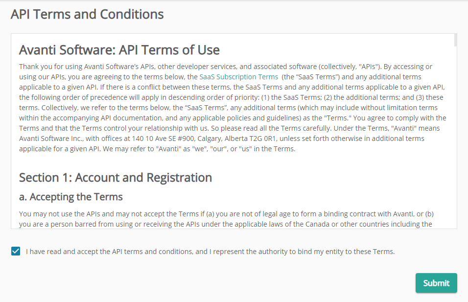

# Client Credentials

Valid Client Credentials, a Client ID and Secret, are required to request an access token. To generate Client Credentials:

1. Login to your Avanti Self-Service Portal with a Class A (Administrator) Avanti User with the **ADMIN** user group.

2. Manually navigate to the API Settings page:

**https://myavanti.ca/{Organization ID}-api/admin/apisettings**

You may notice that there is  **-api** after the Organization ID in the URL. This is the base URL that you will use to make API calls, not the URL to your Avanti Self-Service Portal.

3. Read and agree to the Terms and Conditions, if required.

4. Click the **Generate Client** button to create a new client.

5. Enter a name for the client. While client names are for display purposes only and can be named anything you want, we recommend a description of how the client will be using the Avanti API. For example, 'System X Integration'. 

6. Select **Client Never Expires** to allow this client access indefinitely. If the client should expire, enter the date that the client should no longer have access in **Client Expiry Date**. Setting a client expiry is useful when:
- creating a short-term integration
- providing the credentials to a third party who only needs access for a limited time

7. Enter the number of minutes before access tokens will expire. It is best practices to make your access tokens as short-lived as possible.

8. Select **Generate** at the bottom of the form to create the client.

9. Copy the Client ID and the Client Secret and store it in a safe place.

When requesting an access token, add the Client Credentials in the **client_id** and **client_secret** parameters. If valid credentials are not provided, the request will fail with an **invalid_client** error.
