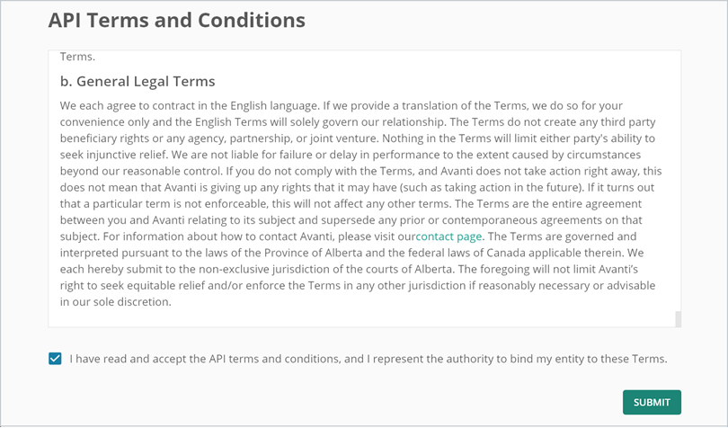

# Create Client Credentials
For your API developer to start using Avanti’s API, you’ll need to create the Client Credentials.

<!-- theme: info -->
>Curious about how we authenticate using client credentials? Our API authentication follows the [Open ID Connect](https://openid.net/connect/) Protocol to authenticate requests using short-lived access tokens.

## Create the Client Credentials
Avanti 10 must be applied before you can create Client Credentials. 

**Step 1:** Select **System Configuration** in the New Avanti Experience on ASSP. 

<!-- theme: info -->
>You’ll need to login as a Regular Avanti User with an ADMIN user group.  

**Step 2:** In System, select **API Settings**.

**Step 3:** If this is your first time creating an API Client, you’ll need to read and agree to the [Terms and Conditions.](https://www.avanti.ca/api-terms-of-use)

**Step 4:** Select **Generate Client**.

**Step 5:** Enter a description in **Client Name**. 

<!-- theme: info -->
>While client names are for display purposes only and can be named anything you want, we recommend a description of the integration. 
For example, if you’re using the integration to add new employees into Avanti, you could call the client **Hire New Employees**. 

**Step 6:** Select **Client Never Expires** to allow this client access indefinitely. If the client should expire, enter the date the client should no longer have access in **Client Expiry Date**. 

<!-- theme: info -->
>Be cautious with clients that don’t expire; you're essentially granting lifetime access to this endpoint to anyone with these credentials. 

Setting a client expiry is especially useful when:
- creating a short-term integration.
- providing the credentials to a third party who only needs access for a limited time.

**Step 7:** Enter the number of minutes before access tokens expire. 

<!-- theme: info -->
>It is best practice to make your access tokens as short-lived as possible. If you’re unsure how long the client credentials need to be active, contact your API developer. 

**Step 8:** Select **Generate** to create the client. 

**Step 9:** Copy the Client ID and the Client Secret and store them in a safe place. You’ll need to send these to your API developer. 

**Step 10:** Select **Exit Configuration**. 

## Identify the Avanti Company Database Name
You’ll need the Company Database name so the integration knows which Avanti company to access. If your integration includes multiple companies, you’ll need to identify every company and provide them to your API Developer. This name is different from the company name you see displayed when you select the company in Avanti.

**Step 1:** Copy the **Company Database** on the System Info Tab in Administration Settings. You'll need to send this to your API Developer.
By default, this can be found in Administration on the Avanti Self-Service Portal. 

## Provide Information to the API Developer
Wonderful! You’re all done setting up everything in Avanti for the API. Now, all you need to do is pass some information onto your API Developer. Here’s what they’ll need to get started:
- The URL for the API documentation https://apidocs.avanti.dev/. 
- The name of the endpoint. If you’re using a reporter endpoint, they’ll also need the ID of the Report you created in [Custom Endpoints.](https://avanti.stoplight.io/docs/avanti-api/ZG9jOjgxNDM2NzE-custom-endpoints)
- The Avanti Username and Password created in [Employee Access](https://avanti.stoplight.io/docs/avanti-api/ZG9jOjgxNDM2NzA-employee-access). 
- The API Client Credentials - the Client ID and the Client Secret. 
- The Avanti Company Database Name.
- Your Avanti Self-Service Portal URL.

Great! You’re all done setting up access to the API and your developer is ready to get started. 