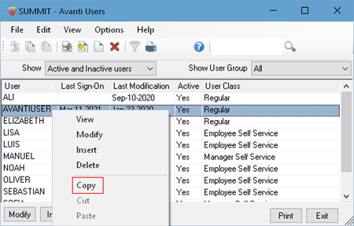
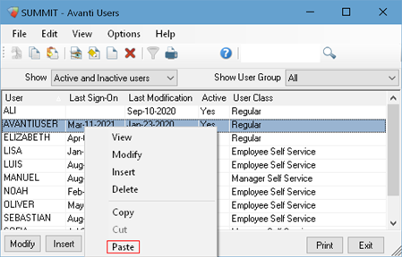
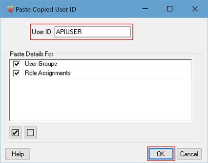
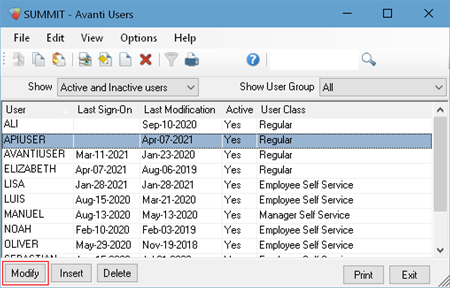
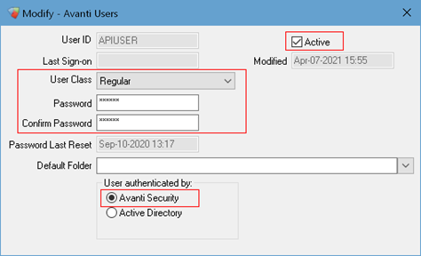
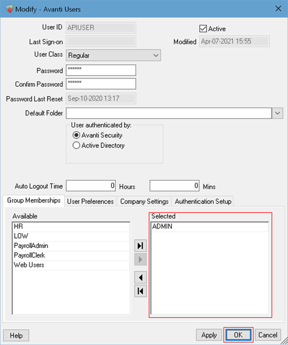

# Allow Employee Access

You’ll need an Avanti User to access the Avanti API endpoints. This User dictates which employees the API can access. 

We recommend creating a dedicated Avanti User for API authentication. If your integrations need different permissions in Avanti, you can create different users for each integration. 

For example, you should have two users if you’re integrating with both a human resources and time collection service – a user with the necessary HR roles and another with the necessary time collection roles.

You can create a user on the Avanti Desktop Application in Avanti Users. If you’re an API developer, you’ll need to get the Avanti User from the organization’s Avanti Administrator. 

The Avanti User must:
- be Active
- have a Regular or Manager Self Service User Class
- use Avanti Security
- have a User Group with access to the company and the required Pay Groups
- have the role permissions to the required employee positions granted in User Role Assignments

If you need an additional license to create the Avanti User, please contact your Client Success Manager at Success@avanti.ca.

### Create a User in Avanti
Rather than create a new user, we recommend copying an existing user who already has the correct access to Avanti employees. 

**Step 1:** Select a user with the correct employee access, right-click and select **Copy** in Avanti Users.
By default, this can be found in System Administration >> System Access Controls on the Avanti Desktop Application. 

**Step 2:** Right-click and choose **Paste**. 

**Step 3:** Add the **User ID**. Keep **User Groups** and **Role Assignments** selected in Paste Details, then click **OK**.  

<!-- theme: info -->
>##### Additional Information
>It’s a great idea to name the User ID after your integration, so you can easily remember what this is for in the future. It may take a couple of moments to create the Avanti User.  
Please make a note of the User ID; you’ll need to send it to your API developer. 

**Step 4:** Select the Avanti User you just created, then click **Modify**. 

**Step 5:** Set the following for the Avanti User: 
- Select **Active**, if it’s deselected. 
- Select either **Regular** or **Manager Self-Service** for User Class, .
- Add a secure **Password** for the Avanti User, then **Confirm Password**. 
- Select **Avanti Security** in User Authenticated By, if it’s not already selected. 

<!-- theme: info -->
>##### Additional Information
>Please make a note of the User Password; you’ll need to send it to your API developer. 

**Step 6:** Make a note of the User Groups in the **Selected Column** then select **OK** to save your changes.  

<!-- theme: info -->
>##### Additional Information
>You’ll need this information to allow access to the endpoint.

<!-- theme: warning -->
>If you're viewing or altering employee information using the API, the user must have pay group and role permissions to the employee.   
>Looking for more information on how access to employees works in Avanti? Check out our [Role Assignments](https://help.avanti.ca/en/support/solutions/articles/36000129028-role-assignments) on Avanti's Help center. 

Nice work! The Avanti User is all set up. The next you'll need to [Allow Access to the Endpoint](/docs/auth-subfunction.md) for more information.  