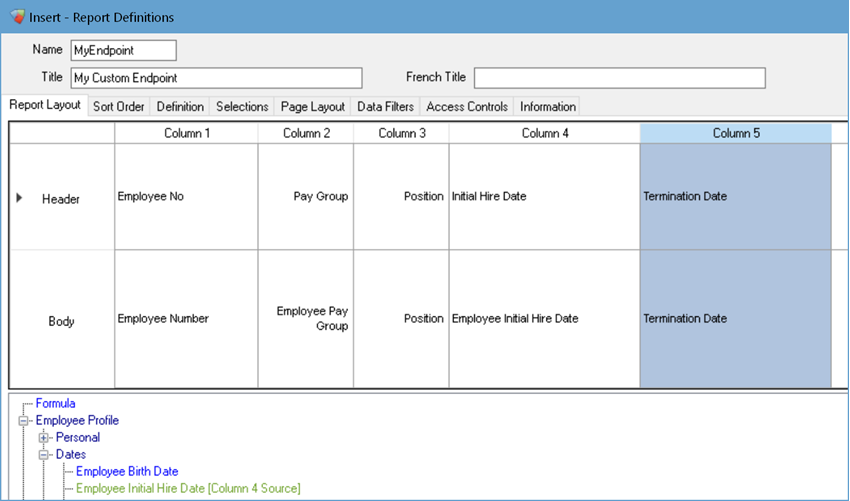
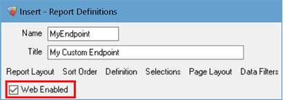
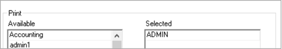

# Custom Endpoints

If none of our standard endpoints provide the required data, you can build custom endpoints using Avanti's reporting tools. Report Designer provides access to most employee-centric information and is available via the [Reporter](https://avanti.stoplight.io/docs/avanti-api/b3A6NjA3NTk0Nw-get-report-data) endpoint.

To get started, open Report Definitions in the Avanti Desktop Application and select Insert to create a new report. Give the report a name (also known as the Report ID) and title. Now add the information you want in your endpoint as columns in the report.



In the example above, we created a new report called **MyEndpoint** and added some employment data sources such as pay group, position, hire date and termination date. 

Next, select **Web Enabled** on the **System Access** tab. 



Restrict access to **Print** so only the API user can access the report. 



Once you finish creating your report and select OK to save the changes, you can start making requests to the [Reporter](https://avanti.stoplight.io/docs/avanti-api/b3A6NjA3NTk0Nw-get-report-data) endpoint. 

<!-- theme: info -->
><b>Employee Access</b><br>
>The API User must have pay group and Time Entry role permissions to return an employee's information. Role permissions aren't restricted based on inactive positions; if the user has access to an employee's inactive position, the employee's information is returned. 

When making a request, you will need to provide the Report ID to your custom report. Property names are generated based on column headers and are converted to valid camel-cased property names. For example, a column header **Employee No** would become **employeeNo**. Columns that do not have any data will exclude the property.

Based on the example above, the endpoint will return data like this:

```
GET /v1/Reporter/MyEndpoint

[
    {
        "employeeNo": "000000011",
        "payGroup": "001",
        "position": "3000",
        "active": "Y",
        "initialHireDate": "1992-03-06T00:00:00"
    },
    {
        "employeeNo": "000000012",
        "payGroup": "001",
        "position": "9001",
        "active": "Y",
        "initialHireDate": "1990-02-28T00:00:00",
        "terminationDate": "2019-08-01T00:00:00"
    },
    {
        "employeeNo": "000000013",
        "payGroup": "001",
        "position": "9001",
        "active": "Y",
        "initialHireDate": "2000-01-01T00:00:00"
    },
		...
]
```

A bad request error will occur if the request is for:
- an invalid Report ID
- a valid Report ID that the API User does not have access to print based on **Access Controls**.

```
{
    "title": "One or more validation errors occurred.",
    "status": 400,
    "errors": {
        "": [
            "Valid Report ID is required."
        ]
    }
}
```
